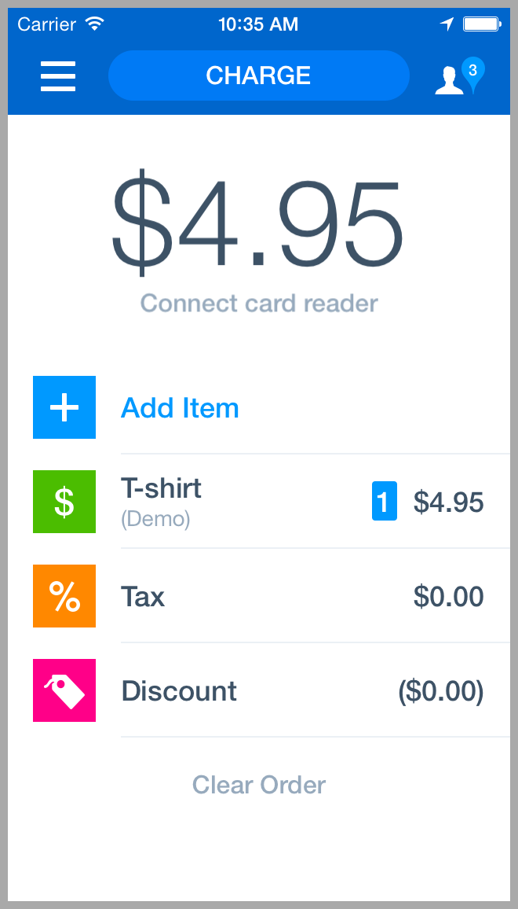
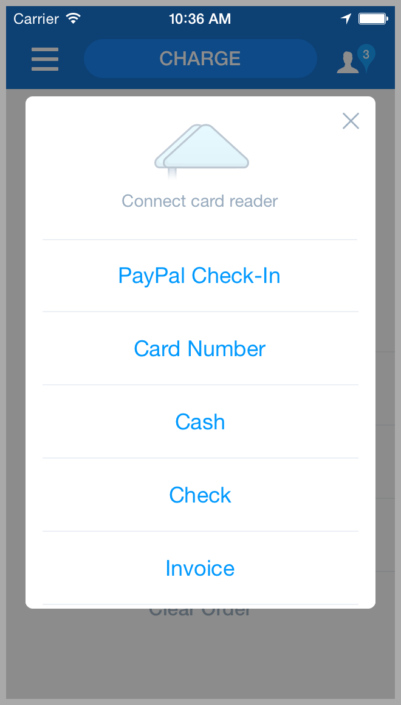
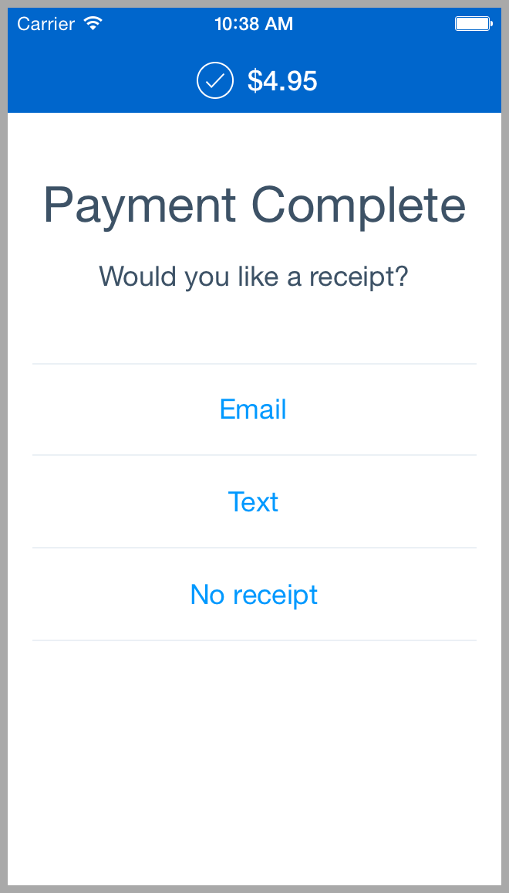

# PayPal Here™ Mobile Apps API

## Getting Started Guide, version 1.3

The functionality described in this document is subject to change.


### Overview
Your order-entry mobile app can send an invoice to the PayPal Here app on iOS or Android. The invoice is sent as part of a URL that launches the PayPal Here app.

For sample code, see _Appendix C: Sample Code in Objective-C_.

For information about launching the PayPal Here app, see _Appendix D: Confirming the PayPal Here App Is Installed on a device_.


### Prerequisites
* If your app is a native iOS app, the development of your app requires the Xcode 4.3 (or later) integrated development environment.
* Testing your app requires that you already have a device that is set up with the [PayPal Here mobile app](https://www.paypal.com/webapps/mpp/credit-card-reader-faq) and the PayPal Here credit-card reader.


### Use Case
A merchant installs your order-entry app, and the PayPal Here app, on a device. Then, a merchant can:
* Use your app to assemble an order
* Use your app to send the order, as an invoice, to launch the PayPal Here app
* Use the PayPal Here app to adjust the amounts as necessary, or add items, and then accept payment with a credit card, PayPal, cash, an invoice or a check

Thus, during the _Order and Payment Flow_:
* Your app sends an order to the PayPal Here app (using the API)
* The order details are pre-populated within the PayPal Here app
* The merchant uses the PayPal Here app to accept a payment
* After the payment is successful, the merchant is returned to your app


## Sending an Invoice to the PayPal Here Mobile App
To send an invoice to the PayPal Here app, specify a URL. The URL root is the following:

    paypalhere://takePayment?

When the URL root is used with the input fields discussed in this document, the PayPal Here mobile app
is launched. **Most of the input values must be URL-encoded**, but the invoice data **may be** Base64-
encoded instead (see below).

**Note:** If the merchant has installed your app, but has **not** installed the PayPal Here app, your app should direct users to the app store: See _Appendix D: Confirming the PayPal Here App Is Installed on a Device_. 

The invoice data is sent in a JSON object. Before encoding, the full URL, with the required fields, will be in a format like the following:

    paypalhere://takePayment?
    accepted=cash,card,paypal
    &returnUrl=my_registered_location://takePayment/{result}?Type={Type}&InvoiceId={InvoiceId}&Tip={Tip}&TxId={TxId}
    &as=b64
    &step=choosePayment
    &payerPhone=4155551212
    &invoice=
    {
        "paymentTerms": "DueOnReceipt",
        "discountPercent": "0",
        "currencyCode": "USD",
        "number": "1457",
        "payerEmail": "foo@bar.com",
        "itemList": {
            "item": [
                {
                    "taxRate": "8.5000",
                    "name": "Curtains",
                    "description": "Blue curtains",
                    "unitPrice": "29.99",
                    "taxName": "Tax",
                    "quantity": "1"
                },
                {
                    "taxRate": "0",
                    "name": "Delivery Fee",
                    "description": "Delivery Fee",
                    "unitPrice": "5.0",
                    "taxName": "Tax",
                    "quantity": "1"
                }
            ]
        }
    }


### Invoice as a JSON object
Put the invoice data (one or more items and amounts) into a JSON object.

The JSON object’s format is largely the same as the invoice format in the PayPal Invoicing Service. For information about the available fields, see the descriptions in [CreateInvoice (a call in the Invoicing Service)](https://developer.paypal.com/webapps/developer/docs/classic/api/invoicing/CreateInvoice_API_Operation/). However, only certain fields are used; see the section "Call Reference" below for more details.

Note that duplicate items are ignored in the `itemList`; instead, you should increment the quantity.

**Note:** Sending an invoice field with no value (for example, sending `“payerEmail”: “”`) will cause unexpected behavior, so remove any fields that lack a value.

For example, before encoding the values of each input field, the JSON object could be the following:

```json

    {
        "paymentTerms": "DueOnReceipt",
        "discountPercent": "0",
        "currencyCode": "USD",
        "number": "1457",
        "payerEmail": "foo@bar.com",
        "itemList": {
            "item": [
                {
                    "taxRate": "8.5000",
                    "name": "Curtains",
                    "description": "Blue curtains",
                    "unitPrice": "29.99",
                    "taxName": "Tax",
                    "quantity": "1"
                },
                {
                    "taxRate": "0",
                    "name": "Delivery Fee",
                    "description": "Delivery Fee",
                    "unitPrice": "5.0",
                    "taxName": "Tax",
                    "quantity": "1"
                }
            ]
        }
    }

```

Note: In the JSON input object (containing the invoice data), you may provide a unique invoice ID (in the `number` field). It must be unique to the merchant. If you leave out the number field, an invoice ID will be assigned, but if you provide the number field with a repeated value, or no value, (for example, if you send `“number”: “”`, or send `“number”: “12345”` every time), unexpected behavior will result.

To use this invoice to send Paypal Invoices, see [How to Send an Invoice Using the Invoicing Service](https://developer.paypal.com/webapps/developer/docs/classic/invoicing/ht_invoicing-send/). Also see _Appendix A: Sample HTML and Javascript Code_.


### Encoding the JSON invoice
This JSON object with the contain the invoice data must be either Base64-encoded (recommended) or URL-encoded. 
Use the as input field to indicate whether you will Base64-encode the JSON invoice object. Note that the `as` input field only applies to the invoice data.

If you plan to Base64-encode the JSON invoice object (recommended), set the `as` input field to `b64`:

    paypalhere://takePayment?as=b64

Omit the `as` parameter if you plan to URL-encode the invoice instead.


### URL-Encoded Input Data
Append (to the URL root) your input fields and their URL-encoded data. These input fields include the
as input field, described above. For information in this document about the fields, see Call Reference.
For example, the fields and values could be the following, before the values are encoded:

    accepted=cash,card,paypal,
    &returnUrl=my_registered_location://takePayment/{result}?Type={Type}&InvoiceId={InvoiceId}&Tip={Tip}&TxId={TxId}
    &as=b64
    &step=choosePayment
    &payerPhone=4155551212
    &invoice=[JSON object, which in this case is Base64-encoded]


### Response URL from the PayPal Here App

After your order-entry app sends an invoice to the PayPal Here app, and the merchant completes the payment flow in the PayPal Here app, the PayPal Here app uses a response URL (`returnUrl`) to re- launch your app.

For examples of the fields returned with this response URL, see Output Fields.

If your app is written in Objective-C, see public tutorials such as [this tutorial](http://code.tutsplus.com/tutorials/ios-sdk-working-with-url-schemes--mobile-6629) for information about handling this event.

For example, the response URL of the PayPal Here app could be similar to the following, which would correspond to the return URL specified in the original request:

    YourAppReturnURLRoot://takePayment?Type=CreditCard&InvoiceId=INV2-AHWG-SQHP-QMLT-1234&Tip=5.00&TxId=111-11-1111

However, if a payment is canceled, the response of the PayPal Here app would be similar to the following:

    YourAppReturnURLRoot://takePayment?Type=UNKNOWN

For sample code for working with the Paypal Here API in Objective C, see Appendix C below.


## Call Reference

Your order-entry app can send an invoice to the PayPal Here app. For a description of this process, in this document, see Send an Invoice to the PayPal Here Mobile App.

### Input Fields

| Input field name  | Description | Comment |
| -------------     | ----------- | ------- |
| accepted          | The payment methods to be offered in the PayPal Here app (i.e., the values that you specify will determine the payment methods offered). Acceptable values are `cash`, `card`, `invoice`, `check`, and `paypal`.  | Individual countries may not allow certain payment methods. This field is optional. |
| returnUrl         | The URL of your app (or mobile web page, email, short URL, SMS, or anywhere a URL can be used).  This value must be a well-formatted URL. The user is sent to this URL after the payment is completed (or the transaction is cancelled). **See _“Structuring the returnUrl Input Field,”_ below.** The URL can include placeholders (using curly braces), which will be replaced with desired transaction information. | This field is optional.  |
| as                | Set the optional `as` input field to `b64` if you will Base64-encode the JSON invoice object. If you won’t Base64-encode the JSON invoice object, omit the as parameter. Base-64 encoding (used if you specify `as=b64`) is recommended for the JSON invoice object (as an alternative to URL-encoding) because Base-64 encoding is more likely to result in correct encoding.  | For information about the JSON invoice object, see `invoice`, below. |
| step              | Where the merchant will begin after being taken to the PayPal Here app. Send nothing to start on the order entry page. Send `choosePayment` to cause the payment options screen to display automatically.| |
| invoice           | A JSON object that contains the invoice data. | See the following section of this document: _Invoice as a JSON object_  |
| payerPhone        | If the buyer email address is known ahead of time, this can be specified in the invoice directly. However, if the buyer's phone number is known and your app desires an SMS receipt to be offered to them, the `payerPhone` field will be used to pre-fill that field in US format. |  |


### Structuring the `returnUrl` Input Field

The data for the `returnUrl` input field is a URL that can include placeholders for the desired transaction information. That is, you can use curly braces in the URL for the PayPal Here app to return specific data about the transaction. The following table provides information about the keys you can use and the data they will get replaced with.

As an example, if your return URL is:
`myAppURLScheme://returnFromPPH?type={Type}&pph_inv_id={InvoiceId}`

Then it will get changed into something like:
`myAppURLScheme://returnFromPPH?type=CreditCard&pph_inv_id=12345`

| Field of the `returnUrl` input field  | Description |
| -------------     | ----------- |
| Root URL of your app, including the call that was invoked by your app. Example: `my_registered_location://takePayment` | The PayPal Here app uses this value to return the merchant to your app, after payment |
| `Type` | The type of payment made, e.g. `SWIPE`. Specify `Type={Type}` See _Output Fields_ below for a comprehensive listing |
| `InvoiceId` | The invoice ID. Specify `InvoiceId={InvoiceId}` |
| `Tip` | The tip, if applicable. `Specify Tip={Tip}` |
| `TxId` | The tax ID of the merchant. Specify `TxId={TxId}` |


### Output Fields

| Input field name | Description |
| ---------------- | ----------- |
| `Type` | The payment method, for example `SWIPE`. Returned values are listed below, but your code should be able to handle new values as they get introduced. <br /><br /> If the transaction was interrupted, for example if a credit card was declined, the value is `UNKNOWN`. Note: If a credit card is declined, the merchant can enter an alternative payment method. <br /><br /> If the merchant cancels, the order-entry’s return URL is called, appended with `Type=UNKNOWN`. <br /><br />Due to legacy issues, the values for "Type" currently differ based on the version being used.<br />On PayPal Here versions 2.x on all platforms, these values can be: `UNKNOWN`, `KEY`, `SCAN`, `SWIPE`, `PAYPAL`, `CHECK`, `CASH`, `CHIP`, `EMV_SWIPE`.<br />On iPad 1.x, these values can be: `Unknown`, `CreditCard`, `Check`, `Cash`, `PayPal`, `DebitCard`, `Other`, `ChipCard`.<br /><br />You should code your integrations to handle new values being returned in this field.|
| `InvoiceId` | The ID of the new invoice for which payment was accepted. For information about the input value that corresponds to this ID, see __Invoice as a JSON object.  |
| `Tip` | The monetary value tip, if applicable. |


## Order and Payment Flow

This section uses an example of charging a credit card to outline steps for:

* Using an order-entry app to send an invoice to the PayPal Here app
* Accepting a payment in the PayPal Here app

After the merchant accepts the payment, your order-entry app is re-launched so the merchant can
confirm that the payment was successfully recorded in the order-entry app.

The following steps describe a version of an order and payment flow.

1. Merchant starts the order-entry app and brings up an order.
2. Merchant chooses **Pay** in the order-entry app.
3. The order-entry app uses the following URL and fields to launch the PayPal Here app:
`paypalhere://takePayment?[URL-encoded input fields]&invoice=[invoice as a base64-encoded JSON object]`
4. Merchant logs into Merchant’s PayPal account. On the Charge screen, the PayPal Here app displays the items and amounts of the order.
  * 
5. In the PayPal Here app, Merchant chooses **Charge**.
6. . On the Payment Options screen, the Merchant can choose Card, or swipe the card. If the Merchant chooses a different option on the following screen, subsequent steps would differ from those below.
  * 
7. On the Card Info screen, Merchant can swipe the credit card, as in this example. If Merchant keys in the card or uses a different payment method, the screens are different.
8. Merchant gives the phone to the customer so the customer can sign for the payment. The customer signs and hands back the phone.
9. Merchant asks the customer if the customer wants a receipt, and Merchant can choose to send the receipt.
  * 
10. A confirmation is displayed, and when Merchant chooses **Done**, the following occurs: PayPal Here re-launches the order-entry app by calling the URL that was passed in as the return URL in the original call to the PayPal Here app. In that URL, PayPal Here includes the status of the transaction, so the order-entry app can display the status (see the Type output field in the _Call Reference_). If the payment was unsuccessful, the order-entry app records the lack of success and restarts at an appropriate step above.


## Appendix A: Sample HTML and Javascript Code

The following code is an example of a call to the PayPal Here mobile app URL (`paypalhere://takePayment?`). The input fields include an invoice, as a Base64-encoded JSON object. **Note:** This code has references to standard javascript libraries.

* [sample.html](./sample.html)


## Appendix B: Function for URL-Encoding in Objective-C

For apps written in Objective-C, the following function shows how to URL-encode data (for the data of your input fields).

```Objective-c

    - (NSString *)urlEncode:(NSString *)rawStr {
        NSString *encodedStr = (NSString *)CFBridgingRelease(
            CFURLCreateStringByAddingPercentEscapes(
                NULL,
                (__bridge CFStringRef)rawStr,
                NULL,
                (CFStringRef)@"!*'();:@&=+$,/?%#[]",
                kCFStringEncodingUTF8));
        return encodedStr;
    }


```

## Appendix C: Sample Code in Objective-C
The following is sample code in Objective-C that works with the PayPal Here mobile apps API.

**Important:** Also see the complete sample app provided in this repository.

For an example of how to do correct URL-encoding, see _Appendix B: Function for URL Encoding in Objective-C_.

This sample code uses the JSONKit parser, but your app may use a different JSON parser instead.

```Objective-c

    // Step 1: Create Invoice JSON Object
    // Invoice contains an array of items
    NSMutableDictionary *itemListDictionary = [NSMutableDictionary dictionary];
    NSMutableArray *itemListArray = [NSMutableArray arrayWithCapacity:1];
    NSMutableDictionary *item = [NSMutableDictionary dictionary];
    // Create an item
    [item setObject:@"8.50" forKey:@"taxRate"];
    [item setObject:@"T-shirt" forKey:@"name"];
    [item setObject:@"Blue T-shirt" forKey:@"description"];
    [item setObject:@"15.99" forKey:@"unitPrice"];
    [item setObject:@"Tax" forKey:@"taxName"];
    [item setObject:@"1" forKey:@"quantity"];
    // Add the item to the dictionary
    [itemListArray addObject:item];
    // TODO: More items can be added as needed
    [itemListDictionary setObject:itemListArray forKey:@"item"];
    // Create invoice
    NSMutableDictionary *invoiceObj = [NSMutableDictionary dictionary];
    // Add invoice details including items from above
    [invoiceObj setObject:@"DueOnReceipt" forKey:@"paymentTerms"];
    [invoiceObj setObject:@"0" forKey:@"discountPercent"];
    [invoiceObj setObject:@"USD" forKey:@"currencyCode"];
    [invoiceObj setObject:@"9876" forKey:@"number"];
    [invoiceObj setObject:@"foo@bar.com" forKey:@"payerEmail"];
    [invoiceObj setObject:itemListDictionary forKey:@"itemList"];

    // Step 2:Prepare request data
    // Convert the Invoice object into JSON - this sample uses NSJSONSerialization but any JSON parser (JSONKit) can be used
    NSError *e = nil;
    NSData *jsonData = [NSJSONSerialization dataWithJSONObject:invoiceObj options:0 error:&e];
    NSString *jsonDataStr = [[NSString alloc]initWithData:jsonData encoding:NSUTF8StringEncoding];
    // url encode the invoice object
    NSString *encodedInvoiceJsonString = [self urlEncode:jsonDataStr];
    // urlencode the accepted payment types
    NSString *encodedAcceptedPaymentTypes = [self urlEncode:@"cash,card,paypal"];
    // TODO: Update URL below to match with your application URL Scheme
    // This is how PayPalHere will launch your application
    NSString *returnUrl = @"myapp://my-return-handler?{result}Type={Type}&InvoiceId={InvoiceId}&Tip={Tip}&Email={Email}&TxId={TxId}";
    NSString *encodedReturnUrl = [self urlEncode:returnUrl];
    // Create PayPal Here launch URL
    NSString *pphUrlString = [NSString stringWithFormat:@"paypalhere://takePayment?accepted=%@&returnUrl=%@&invoice=%@&step=choosePayment",
        encodedAcceptedPaymentTypes, encodedReturnUrl, encodedInvoiceJsonString];
    NSLog(@"PayPal Here URL = %@", pphUrlString);
    // Create URL object from string
    NSURL * pphUrl = [NSURL URLWithString:pphUrlString];

    // Step 3: Launch PayPal Here application
    UIApplication * ourApplication = [UIApplication sharedApplication];
    // Check if PayPal Here app is installed
    if ([ourApplication canOpenURL:pphUrl]){
        // Launch PayPal Here app
        [ourApplication openURL:pphUrl];
    } else {
        // Handle case when PayPal Here app is not installed
        // or launch PayPal Here app page in appstore:
        //    http://itunes.apple.com/us/app/paypal-here/id505911015
    }

```

### Appendix D: Confirming the PayPal Here App Is Installed on a Device

* If your app uses HTML and JavaScript, and the launch of the PayPal Here app fails, your app should direct users to the app store.
* If your app is written for Android, and the Paypal Here app cannot be launched, your app should direct users to the Play Store.

If your app is written in Objective-C or Swift, you can use the `canOpenURL` function in the [UIApplication class](https://developer.apple.com/library/ios/DOCUMENTATION/UIKit/Reference/UIApplication_Class/Reference/Reference.html) to confirm that the PayPal Here app is installed and then launch it, and if necessary direct users to the app store. For example:

```Objective-c

    UIApplication *ourApplication = [UIApplication sharedApplication];
    NSString *ourPath = [@"paypalhere://" stringByAppendingString:urlInfo];
    NSURL *ourURL = [NSURL URLWithString:ourPath];
    if ([ourApplication canOpenURL:ourURL]) {
        [ourApplication openURL:ourURL];
    } else {
        //Display error
        UIAlertView *alertView = [[UIAlertView alloc] initWithTitle:@"PayPal Here Not Found"
            message:@"The PayPal Here App is not installed. It must be installed to take payment."
            delegate:nil cancelButtonTitle:@"OK" otherButtonTitles:nil];
        [alertView show];
        [alertView release];
    }
```
